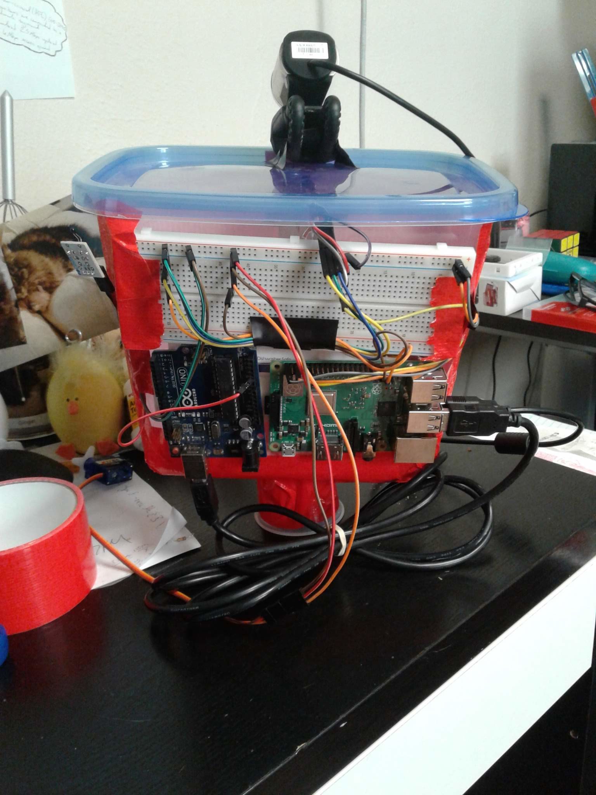

# cat-nanny

Cat Nanny is an IoT cat care system that lets you feed, treat, and play with your pet from anywhere. This is the repo for the Raspberry Pi server.

cat-nanny uses the [RPi.GPIO](https://pypi.org/project/RPi.GPIO/), [sqlite3](https://docs.python.org/3.5/library/sqlite3.html), and [Flask](https://pypi.org/project/Flask/) libraries to control the sensors and servos, while also communicating with the mobile app.

**Components:**
- PIR Motion Sensor
- Analog Temperature Sensor
- FS90R Servos (2)
- Raspberry Pi 3 B+
- Arduino Uno
- Webcam
- Breadboard
- Jumper Cables

**Wiring Diagram:**

**Build:**

This is a picture of the build when it was in progress and the components were attached to the food container.

## Flask
There are two Flask servers running on the Pi. One is listening on port 5000 for sensor interactions and DB queries. The other is listening on port 8081 and is acting as an image server from an [ImageFeed feed](https://github.com/agsimmons/ImageFeed).
